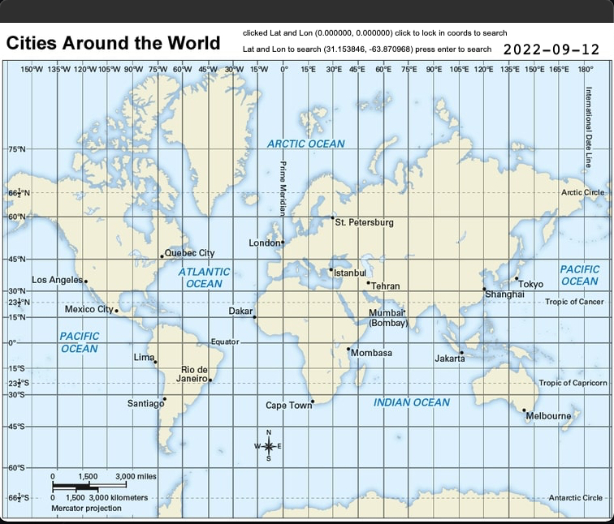
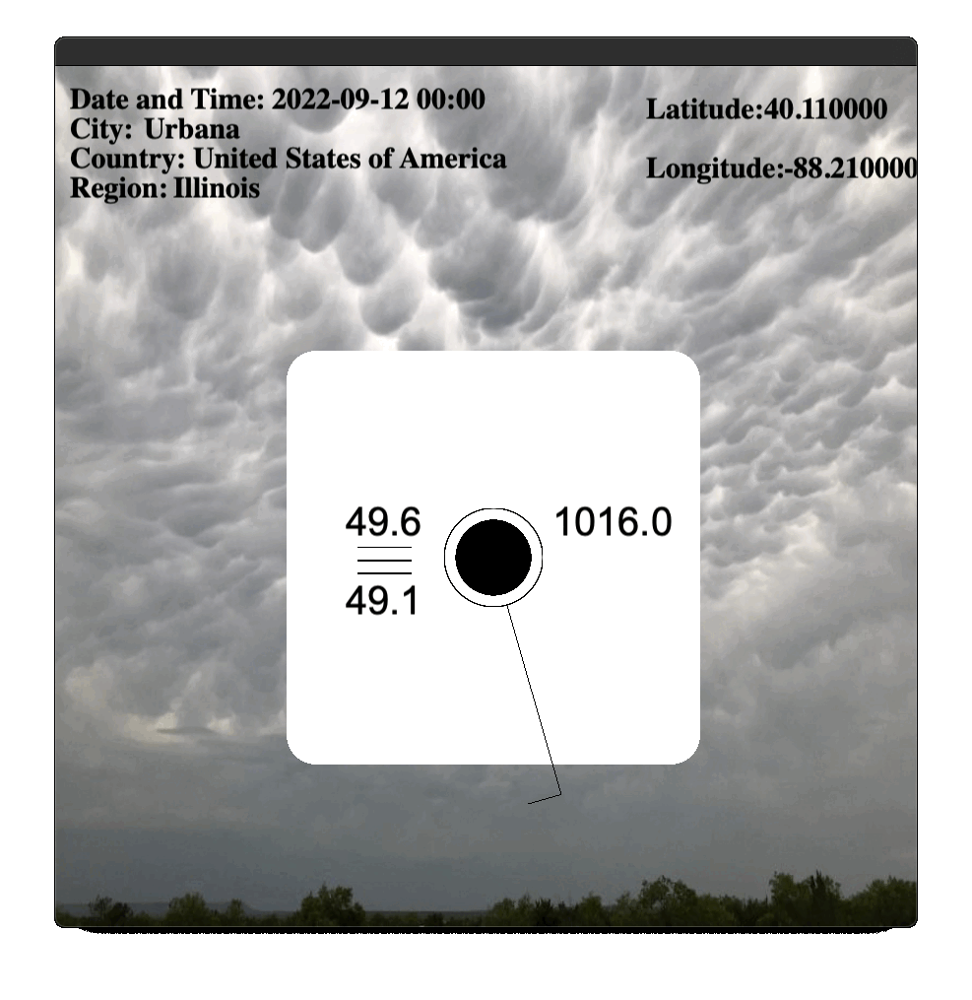

Weather API and Data Display Project
* Lets you view weather data in the form of a weather station (Condenses Info)
* Can be used with any day in the past 7 days and all hours within the given day (if you upgrade API key you can get history back to 2010)
* Extra included data now incorporates Heat and Cold Warnings based on heat index and wind chill values
* Can view Wind direction and speed in knots
* Displays temperature, dewpoint, pressure and pressure change
* See [weather station format](https://www.wpc.ncep.noaa.gov/html/stationplot.shtml) for weather condition and cloud cover

## Installation

> Must have [Cinder](https://libcinder.org/about)  for build environment

**Cinder installation guide**  

1. Download Cinder [here](https://libcinder.org/)
2. Make directory in cinder folder to house cinder projects
3. When cloning this repository make sure to clone into the directory you created
4. If you open Cinder in [Clion](https://www.jetbrains.com/clion/) (or other environment) and press run, it will setup Cinder build environment
5. Now you can open the file and begin use of this project :thumbsup: 
## Usage

- Can use with API key from weatherapi.com and current data must be set up  
the current date so that the requests only go back seven days at max

- Generally responds to Enter/Return to advance a screen and Backspace/Delete takes you back a screen  
  
- Use up/down arrow keys to change date in the map menu, and up/down arrow keys to change hour once you have selected a location

